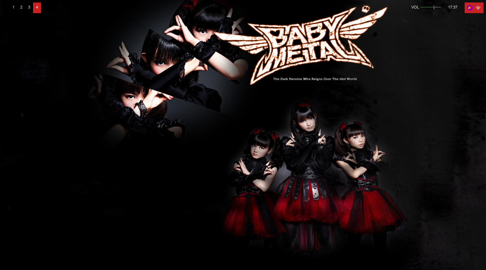
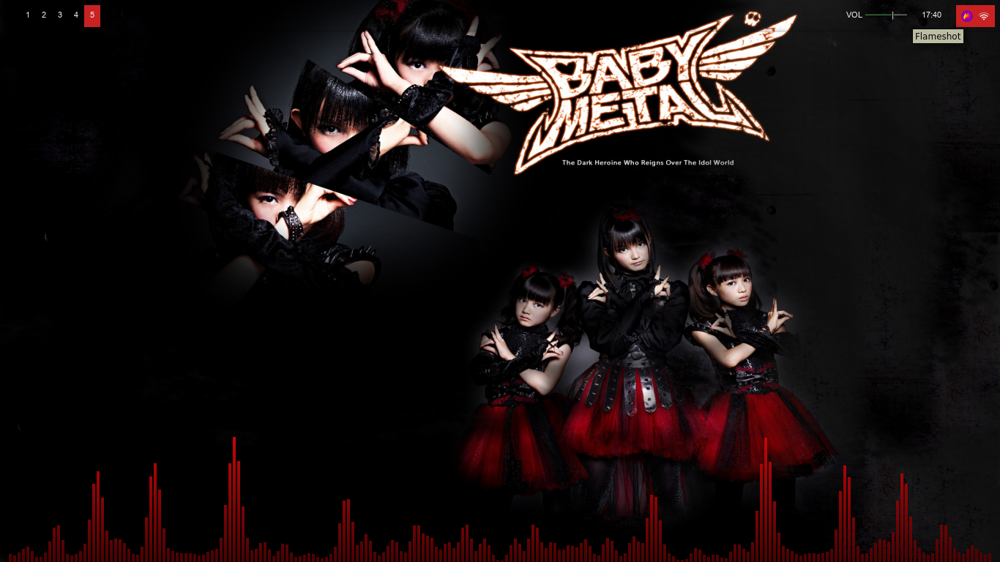
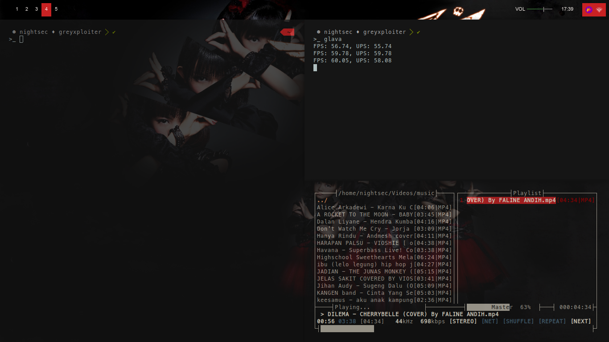
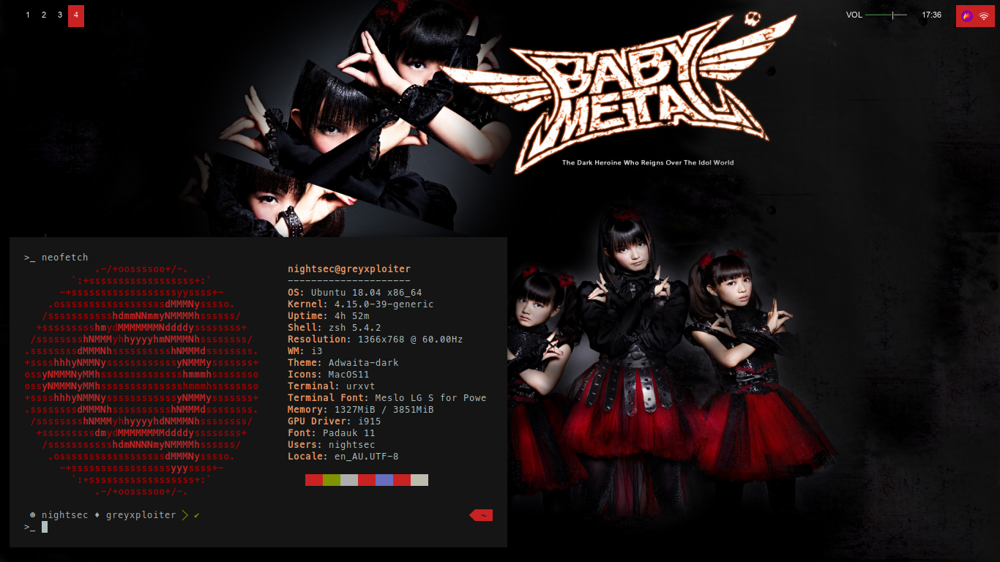
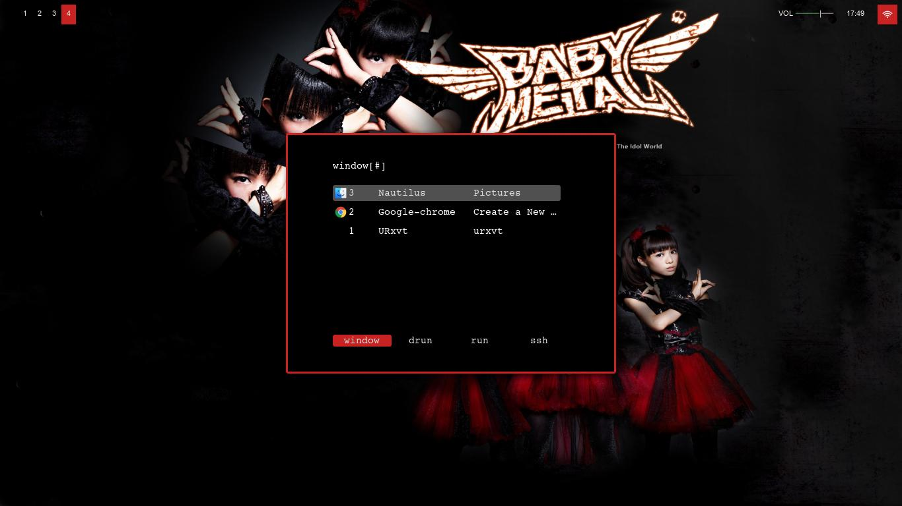

# DOTFILES - BABY METAL EDITION

My personal dotfiles,

## Usage
* Clone this repo
```
git clone https://github.com/defrindr/dotfiles.babymetal_edition.git
```
* Open dotfiles.babymetal_edition folder
```
cd dotfiles.babymetal_edition
```
* Move ```wp_babymetaru.jpg``` to ```/usr/share/wallpapers```
```
mv wp_babymetaru.png /usr/share/wallpapers
``` 
* Move files/folder in below to ```~/``` 
** .Xresources
** .moc
** .zshrc
** .config

## Screenshot








## References Configuration
| Name | Link |
| --------------- | ----------- |
| Compton | [https://wiki.archlinux.org/index.php/Compton](https://wiki.archlinux.org/index.php/Compton) |
| Rofi | [https://github.com/davatorium/rofi/wiki](https://github.com/davatorium/rofi/wiki) |
| Polybar | [https://github.com/polybar/polybar](https://github.com/polybar/polybar) |
| i3 | [https://i3wm.org/docs/](https://i3wm.org/docs/) |
| Powerlevel9k | [https://github.com/Powerlevel9k/powerlevel9k](https://github.com/Powerlevel9k/powerlevel9k) |
| Glava | [https://github.com/jarcode-foss/glava/wiki](https://github.com/jarcode-foss/glava/wiki) |
| Neofetch | [https://github.com/dylanaraps/neofetch](https://github.com/dylanaraps/neofetch) |

